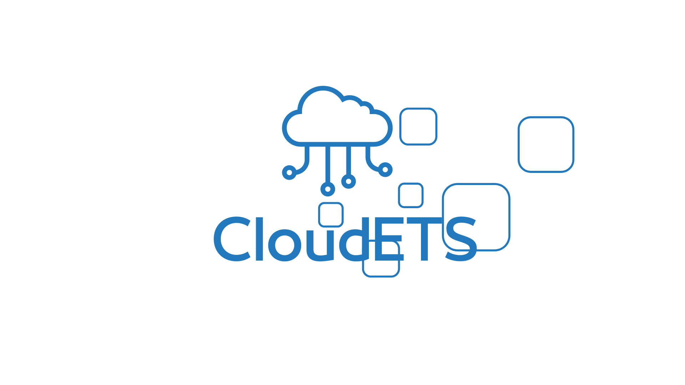

<table>
<tr>
<td>
<a href= "https://www.dell.com/pt-br"></a>
</td>
<td><a href= "https://www.inteli.edu.br/"></a>
</td>
</tr>
</table>

# Desenvolvimento de serviços em cloud computing

## Cumulonimbus

### Integrantes: 
<lu>
<li><a href="https://www.linkedin.com/in/alan-rozensztajn-schipper-0563701ba/">Alan Schipper</a>
<li><a href="https://www.linkedin.com/in/felipesilberberg/">Felipe Silberberg</a>
<li><a href="https://www.linkedin.com/in/erikfreundt/">Erik Freundt</a>
<li><a href="https://www.linkedin.com/in/mateus-neves-3b767123b/">Mateus Neves</a>
<li><a href="https://www.linkedin.com/in/priscila-falc%C3%A3o-3435a1244/">Priscila Falcão</a>
  <li><a href="https://www.linkedin.com/in/sofia-moreiras-pimazzoni/">Sofia Pimazzoni</a>
<li><a href="https://www.linkedin.com/in/victor-severiano-de-carvalho-b57a05237/">Victor Carvalho</a>. </lu>

## 💻 Projeto
<br><br>
O projeto trata-se de uma aplicação mobile, desenvolvida para sistema embarcado (executa localmente através de um arquivo com extensão .apk), com AI de sistema de recomendação, tendo integrado serviços da AWS no back-end e mensageria com o Kafka e o protocolo MQTT. 
<br>
Pensado para o engajamento dos colaboradores da Dell em compartilhamento de informações e conhecimento, além da participação de projetos internos na empresa.
<br><br>
<p align="center">

<br>
<br>
</p>

## 💾 Estrutura de pastas
|📂[imagens](/imagens)<br>
|📂[src](/src)<br>
  &emsp;|📂[Back-end](/src/backend)<br>
      &emsp; &emsp;|📂[src](/src/backend/src)<br>
      &emsp; &emsp; &emsp;|📂[auth](/src/backend/src/auth)<br>
      &emsp; &emsp; &emsp;|📂[controller](/src/backend/src/controller)<br>
      &emsp; &emsp; &emsp;|📂[module](/src/backend/src/module)<br>
      &emsp; &emsp; &emsp; &emsp;|📂[dto](/src/backend/src/module/dto)<br>
      &emsp; &emsp; &emsp; &emsp;|📂[entity](/src/backend/src/module/entity)<br>
      &emsp; &emsp; &emsp;|📂[services](/src/backend/src/services)<br>
  &emsp;|📂 [Front-end](/src/frontend)<br>
  &emsp; &emsp;|📂[build](/src/frontend/build)<br>
  &emsp; &emsp; &emsp;|📂[static](/src/frontend/build/static)<br>
  &emsp; &emsp; &emsp; &emsp;|📂[css](/src/frontend/build/static/css)<br>
  &emsp; &emsp; &emsp; &emsp;|📂[js](/src/frontend/build/static/js)<br>
  &emsp; &emsp; &emsp; &emsp;|📂[media](/src/frontend/build/static/media)<br>
  &emsp; &emsp;|📂[public](/src/frontend/public)<br>
  &emsp; &emsp;|📂[src](/src/frontend/src)<br>
  &emsp; &emsp; &emsp;|📂[assets](/src/frontend/src/assets)<br>
  &emsp; &emsp; &emsp; &emsp;|📂[images](/src/frontend/src/assets/images)<br>
  &emsp; &emsp; &emsp; &emsp;|📂[svg/DellLogo](/src/frontend/src/assets/svg/DellLogo)<br>
  &emsp; &emsp; &emsp;|📂[components](/src/frontend/src/components)<br>
  &emsp; &emsp; &emsp; &emsp;|📂[Modal](/src/frontend/src/components/Modal)<br>
  &emsp; &emsp; &emsp; &emsp;|📂[Ranking](/src/frontend/src/components/Ranking)<br>
  &emsp; &emsp; &emsp; &emsp;|📂[components_css](/src/frontend/src/components/components_css)<br>
  &emsp; &emsp; &emsp;|📂[pages](/src/frontend/src/pages)<br>
  &emsp; &emsp; &emsp; &emsp;|📂[addProject](/src/frontend/src/pages/addProject)<br>
  &emsp; &emsp; &emsp; &emsp;|📂[home](/src/frontend/src/pages/home)<br>
  &emsp; &emsp; &emsp; &emsp;|📂[login](/src/frontend/src/pages/login)<br>
  &emsp; &emsp; &emsp; &emsp;|📂[profile](/src/frontend/src/pages/profile)<br>
  &emsp; &emsp; &emsp; &emsp;|📂[projects](/src/frontend/src/pages/projects)<br>
  &emsp; &emsp; &emsp; &emsp;|📂[submit](/src/frontend/src/pages/submit)<br>
  &emsp; &emsp; &emsp;|📂[routes](/src/frontend/src/routes)<br>
  &emsp; &emsp; &emsp;|📂[scripts](/src/frontend/src/scripts)<br>
  &emsp; &emsp; &emsp;|📂[styles](/src/frontend/src/styles)<br>
  &emsp; &emsp; &emsp;|📂[themes](/src/frontend/src/themes)<br>
|📄[readme.md](/README.md)<br>


## 🛠 Instalação

1 - Clone do GitHub atual
<br>
2 - Para rodar localmente o projeto, é necessário:
&emsp 2.1 - Rodar no prompt de comando dentro da pasta ```backend/src o comando``` ```npm run start:dev``` ;
&emsp 2.2 - Fazer dowload do arquivo .apk dentro da pasta ```codigo```;
<br>
3 - O projeto já está pronto para teste local.
<br>

## 💻 Configuração para Aplicação

1 - Criação de VPC e subredes na AWS
<br>
2 - Criação de EC2 na AWS
<br>
3 - Criação de LoadBalancer na AWS
<br>
4 - Criação de RDS na AWS
<br>
5 - Configuração de variáveis de ambiente para a ligação com os serviços AWS


## 📄 Histórico de lançamentos

A cada atualização os detalhes devem ser lançados aqui.

* Sprint 1 - 10/02/2023
    * Wireframe
    * Arquitetura do sistema V1
    * Matriz SWOT
    * Value Proposition Canvas 
    * Diagrama de sequência do fluxo de dados
    * 5 Forças de Potter
    * Matriz de risco
    * Casos de uso
    * Especificação dos requisitos
* Sprint 2 - 24/02/2023
    * Desenvolvimento GitFlow
    * Definição da arquitetura de pastas
    * Produção de VPCs e subredes
    * Produção de instâncias na EC2
    * Produção de buckets no S3
    * Modelo lógico de dados
    * Modelo conceitual de dados
    * Endpoints TDD
    * Arquitetura da solução V2
    * Adaptação do wireframe para os requistos do cliente
* Sprint 3 - 10/03/2023
    * Back-end com enpoints funcionais
    * Documentação API
    * Front-end em React
    * Arquitetura da solução V3
    * Produção de banco de dados no RDS
* Sprint 4 - 24/03/2023
    * Mudança de ORM (TypeORM)
    * Parte da integração
* Sprint 5 - 07/04/2023
    * Finalização da integração
    * Ajuste de erros
    * Manual do usuário

## 🎓 Referências

Aqui estão as referências usadas no projeto.

1. <https://github.com/iuricode/readme-template>
2. <https://github.com/gabrieldejesus/readme-model>
3. <https://creativecommons.org/share-your-work/>
4. <https://freesound.org/>
5. Músicas por: <a href="https://freesound.org/people/DaveJf/sounds/616544/"> DaveJf </a> e <a href="https://freesound.org/people/DRFX/sounds/338986/"> DRFX </a> ambas com Licença CC 0.

