<table>
<tr>
<table>
<tr>
<td>

</td>
<td>
</td>
</tr>
</table>

# DOCUMENTAÇÃO OFICIAL

<ul>
  <li>Nome do Projeto: Elaboração de aplicação para dispositivos móveis</li>
  <li>Nome do Parceiro: DELL</li>
  <li>Nome do Grupo: Cloudets</li>
  <li>Integrantes do grupo:</li>
  <ul>
  <li>Alan Rozensztajn Schipper</li>
  <li>Erik Freundt</li>
  <li>Felipe Silberberg</li>
  <li>Mateus Neves</li>
  <li>Priscila Falcão</li>
  <li>Sofia Pimazzoni</li>
  <li>Victor Carvalho</li>
  </ul>
<ul>

Template do Documento do Projeto
Módulo 6 - Engenharia de Software
Solução de otimização de corte de bobinas de papel

>*Observação 1: A estrutura inicial deste documento é só um exemplo. O seu grupo deverá alterar esta estrutura de acordo com o que está sendo solicitado nos artefatos.*

>*Observação 2: O índice abaixo não precisa ser editado se você utilizar o Visual Studio Code com a extensão **Markdown All in One**. Essa extensão atualiza o índice automaticamente quando o arquivo é salvo.*

**Conteúdo**

- [DOCUMENTAÇÃO OFICIAL](#documentação-oficial)
- [Visão Geral do Projeto](#visão-geral-do-projeto)
  - [Parceiro de Negócios](#parceiro-de-negócios)
  - [Problema](#problema)
    - [Análise do Problema](#análise-do-problema)
    - [Matriz de avaliação de valor Oceano Azul](#matriz-de-avaliação-de-valor-oceano-azul)
    - [Proposta de Valor e Value Proposition Canvas](#proposta-de-valor-e-value-proposition-canvas)
    - [Matriz de Risco](#matriz-de-risco)
    - [Análise financeira do projeto](#análise-financeira-do-projeto)
  - [Mapeamento do processo](#mapeamento-do-processo)
  - [Descritivo da Solução](#descritivo-da-solução)
    - [Objetivos](#objetivos)
      - [Objetivos gerais](#objetivos-gerais)
      - [Objetivos específicos](#objetivos-específicos)
    - [Justificativa](#justificativa)
  - [Partes Interessadas](#partes-interessadas)
- [Requisitos](#requisitos)
  - [Requisitos Funcionais](#requisitos-funcionais)
  - [Requisitos não Funcionais](#requisitos-não-funcionais)
  - [Perfis de Usuários](#perfis-de-usuários)
  - [Casos de Uso](#casos-de-uso)
  - [Matriz de rastreabilidade](#matriz-de-rastreabilidade)
- [Arquitetura do Sistema](#arquitetura-do-sistema)
  - [Diagrama de sequência do fluxo de dados](#diagrama-de-sequência-do-fluxo-de-dados)
- [UX e UI Design](#ux-e-ui-design)
  - [Benchmarking e Revisão de Design System](#benchmarking-e-revisão-de-design-system)
  - [Wireframes](#wireframes)
  - [Design de Interface - Guia de Estilos](#design-de-interface---guia-de-estilos)
- [Projeto de Banco de Dados](#projeto-de-banco-de-dados)
  - [Modelo Conceitual](#modelo-conceitual)
  - [Modelo Lógico](#modelo-lógico)
- [Testes de Software](#testes-de-software)
  - [Teste Unitário](#teste-unitário)
  - [Teste de Integração](#teste-de-integração)
  - [Teste de Regressão](#teste-de-regressão)
  - [Teste de Usabilidade](#teste-de-usabilidade)
  - [Teste de Funcionalidade](#teste-de-funcionalidade)
  - [Teste de API](#teste-de-api)
- [Documentação da API](#documentação-da-api)
- [Manual do Usuário](#manual-do-usuário)
- [Referências](#referências)
- [Apêndice](#apêndice)

# Visão Geral do Projeto
	

## Parceiro de Negócios

Fundada em 1984, a Dell Technologies é uma renomada empresa que atua no ramo tecnológico através da produção e comercialização de produtos e serviços, estando presente em mais de 180 países ao redor do mundo.

Entre os principais produtos/serviços que a empresa oferece, é possível citar servidores, dispositivos de armazenamento, periféricos, softwares e computadores, sendo este a principal fonte de receita da companhia.

Os principais clientes da Dell são empresas, organizações governamentais e instituições de ensino, bem como consumidores finais. Além disso, a empresa atende a uma ampla variedade de setores, incluindo serviços financeiros, saúde, manufatura, varejo, telecomunicações e serviços públicos. Apesar de ser forte no mercado de varejo, sua principal atuação está no segmento corporativo, sendo líder nesta área.

Em junho de 2022, a companhia apresentou resultados financeiros recorde para o primeiro trimestre do ano fiscal de 2023, ao registrar receita de US$ 26,1 bilhões, o que representa aumento de 16% em relação ao período anterior. Ademais, a empresa gerou resultado operacional recorde para primeiro trimestre de US$ 1,6 bilhão, um aumento de 57%, e recorde de resultado operacional non-GAAP de US$ 2,1 bilhões, um aumento de 21%. O lucro líquido de operações contínuas foi de US$ 1,1 bilhão, aumento de 62%, e o lucro líquido non-GAAP foi de 1,4 bilhão, um aumento de 36%. Os dois foram impulsionados pelo crescimento do resultado operacional e pelas despesas de juros mais baixas devido a saldos de dívida reduzidos. Lucros diluídos por ação foram de US$ 1,37, aumento de 63%, e lucros diluídos por ação non-GAAP foi de US$ 1,84, aumento de 36%.

Com base no resultado financeiro analisado, conclui-se que, mesmo atuando em um mercado competitivo e instável (por estar em constante mudança), a empresa se sobressai aos demais devido aos investimentos em inovação e produtos/serviços de qualidade, além de apresentar gestão eficiente e competente. Dessa maneira, constrói-se um cenário favorável ao desenvolvimento do projeto.

## Problema

A Dell, sendo uma empresa de grande porte, vê a necessidade de criar oportunidades de desenvolvimento e crescimento para os seus colaboradores,assim, tornando-se crucial encontrar novos meios de engajar e desenvolver o crescimento de seus funcionários. Isso porque, com o aumento da competitividade no mercado, as empresas precisam estar constantemente inovando e aprimorando suas práticas e processos. E para que isso aconteça, é necessário que os funcionários estejam engajados e motivados a contribuir com suas ideias e esforços.
 
Além disso, o desenvolvimento dos funcionários é importante para garantir que a empresa possa contar com profissionais cada vez mais qualificados e capazes de enfrentar os desafios que surgem no dia a dia do trabalho.

### Análise do Problema
Neste sentido, nota-se a demanda por uma solução que gere entretenimento e ainda reflita em um uso fluído e natural, a fim de manter o usuário engajado e ainda conseguir desenvolver novas habilidades. Cabe destacar a importância de ser uma aplicação que se assemelhe a lazer, uma vez que é direcionada para momentos fora do horário de trabalho. Assim, sugere-se uma aplicação que esteja de fácil alcance, como uma aplicação mobile, com interface similar a uma rede social popular.

### Matriz de avaliação de valor Oceano Azul

A matriz de oceano azul é uma ferramenta de análise estratégica que ajuda a identificar oportunidades de mercado inexploradas e a criar novas demandas. Ela é usada para definir a posição competitiva de uma empresa em relação aos concorrentes e criar um plano de ação para diferenciar a oferta da empresa e criar um novo mercado. A matriz ajuda as empresas a encontrar novas oportunidades de crescimento, reduzir a concorrência e aumentar a lucratividade.

 <h3> Gráfico 1 - Matriz Oceano Azul.</h3>  
 
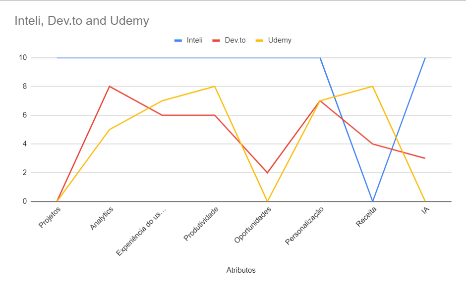

 Fonte: Elaborado pelo próprio autor (2023).

 
 

Projetos (10): a solução desenvolvida pelo Inteli será a única do mercado a oferecer a oportunidade de participar de projetos, se comparado as plataformas já existentes no mercado.

Analytics (10): mesmo as concorrentes já oferecendo informações de controle (dashboards, dados etc), a solução desenvolvida pelo Inteli oferecerá ferramentas completas de Analytics, que auxiliarão os Product Owners e criadores de conteúdo a terem controle total de dados referentes a projetos e conteúdos, respectivamente.

Experiência do Usuário (10): o mercado oferece soluções que apresentam uma experiência decente como a Udemy. Porém, nenhuma plataforma já existente oferece uma experiência fluida e visualmente atrativa como a desenvolvida pelo Inteli.

Produtividade (10): a solução desenvolvida pelo Inteli proporciona uma navegação limpa, bem como conteúdos de qualidade para o usuário. Ademais, estes atributos, juntamente com a oportunidade de projetos, acarretam em uma maior produtividade por parte do usuário.

Oportunidades (10): na aplicação desenvolvida pelo Inteli, além de aprender através de conteúdos (podcasts, artigos, vídeos etc), os usuários também poderão aplicar o conhecimento adquirido em projetos reais, tendo a oportunidade de aumentar se networking e reputação na empresa.

Personalização (10): algumas soluções existentes no mercado como o site dev.to oferecem uma pequena personalização à experiência do usuário. Todavia, a solução desenvolvida pelo Inteli proporciona tanto conteúdos como projetos baseados na atividade do usuário. Dessa forma, haverá uma otimização de tempo na utilização da plataforma, além do aumento da produtividade e satisfação do cliente.

Receita (0): a plataforma desenvolvida pelo Inteli não terá nenhuma forma de ganhar dinheiro, uma vez que seu obejtivo está ligado, exclusivamente, ao aprendizado e aumento do engajamento de seus funcionários.

IA (10): a solução desenvolvida pelo Inteli contará com a atuação de uma Inteligência Artificial de qualidade no que tange a personalização da experiência do funcionário, analisando seu comportamento enquanto usuário e oferecendo conteúdos e projetos de acordo com seus interesses. Tal tecnologia pode ser encontrada em outras soluções, mas com qualidade inferior. 

### Proposta de Valor e Value Proposition Canvas

Value Proposition Canvas é um template de negócios que ajuda a entender o valor da sua solução para a empresa, englobando seus pontos fortes e principalmente, como esses ajudam a resolver dores do cliente. É possível visualizar a proposta de valor na imagem a seguir: 

 <h3> Figura 1 - Value Propostion Canva.</h3>  
 
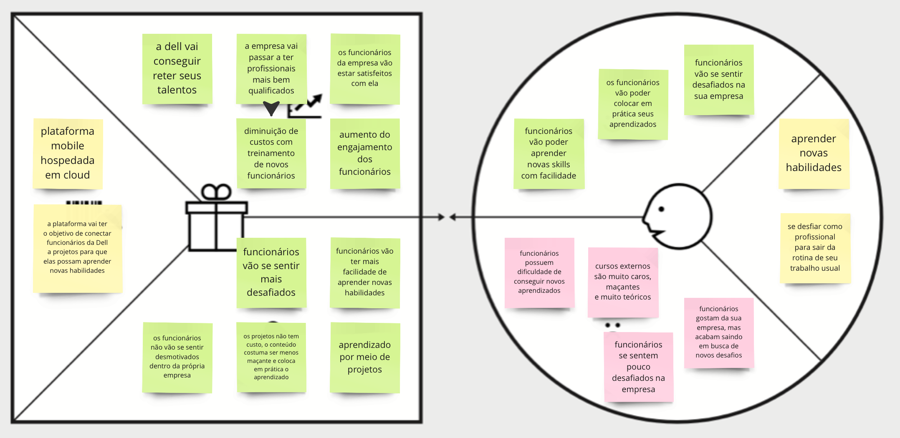

 Fonte: Elaborado pelo próprio autor (2023). 

### Matriz de Risco
Também chamada de matriz de probabilidade e impacto, a matriz mapeia os riscos do projeto, sejam eles tanto riscos de ameaças quanto de oportunidades. Por ser uma ferramenta útil para gerenciar os riscos operacionais existentes em um projeto, foi elaborado uma Matriz de Riscos com base na proposta de solução elaborada pelo time de desenvolvimento, que pode ser visualizada na Figura x.

 <h3> Figura 2 - Matriz de risco.</h3>  
 

 Fonte: Elaborado pelo próprio autor (2023). 

### Análise financeira do projeto

 Para manter o site em funcionamento e fornecer as ferramentas necessárias, a empresa terá alguns custos contínuos, como hospedagem, desenvolvimento, suporte técnico, atualização e manutenção. Embora o site não seja uma fonte direta de lucro para a Dell, ele é visto como uma despesa operacional para aprimorar a equipe de funcionários e melhorar a eficiência e a produtividade da empresa. É importante investir nesses custos para garantir que o site esteja funcionando corretamente e fornecendo novas ferramentas e recursos aos funcionários.

## Mapeamento do processo

O mapeamento do processo envolve práticas envolvidas no entendimento, análise e melhoria desses, de forma a estruturar a organizção com base em processos ponta a ponta. Tem-se como objetivos princiais documentar os processos, avaliar padrões e confrmidade, treinar colaboradores,discutir e planejar mudanças e comunicar de forma padronizada. Dessa forma, viu-se a necessidade de criação do mapeamento do mesmo, conforme as figuras a seguir.

 <h3> Diagrama 1 - Processo 1: Criar publicação.</h3>  
 
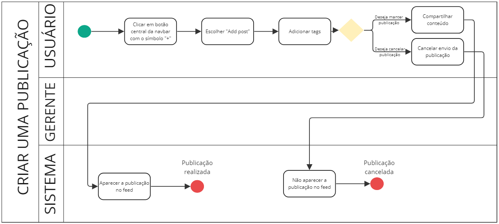

 Fonte: elaborado pelo próprio autor (2023).

 

 <h3> Diagrama 2 - Processo 2: Denunciar publicação.</h3>  
 
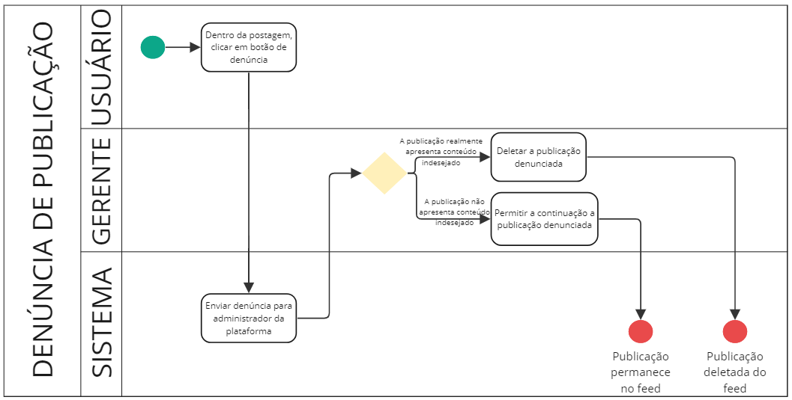

 Fonte: Elaborado pelo próprio autor (2023). 

 

 <h3> Diagrama  3 - Processo 3: criar projeto.</h3>  
 
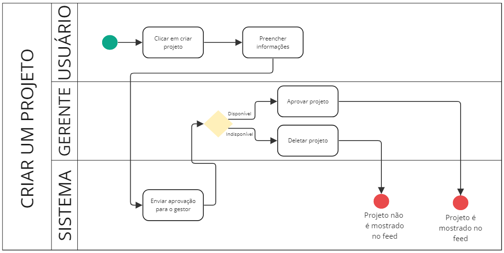

 Fonte: Elaborado pelo próprio autor (2023). 

 

 <h3> Diagrama 4 - Processo 4: Inscrever em um projeto.</h3>  
 
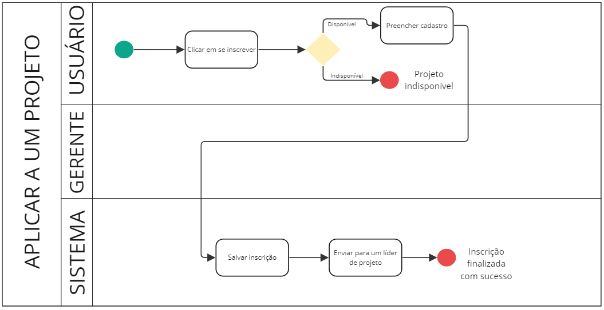

 Fonte: Elaborado pelo próprio autor (2023). 

 

 <h3> Diagrama 5 - Processo 5: Gameficação</h3>  
 
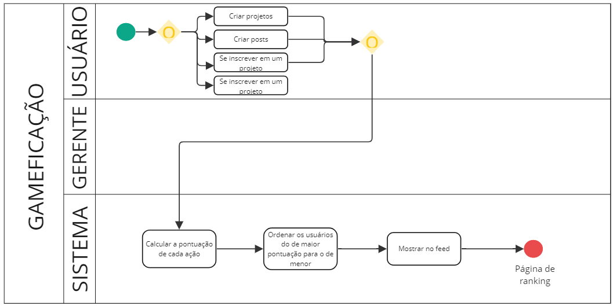

 Fonte: Elaborado pelo próprio autor (2023). 

## Descritivo da Solução

Descrição da solução a ser desenvolvida (o que é, quais principais funcionalidades, como usar) . Caso ainda não esteja definida a solução na Sprint 1, o faça assim que possível.

### Objetivos

Descrever o objetivo geral e os objetivos específicos.

#### Objetivos gerais

#### Objetivos específicos

### Justificativa

Descrever o tipo de arquitetura escolhida, sua justificativa, como deverá ser utilizada e quais os benefícios que ela proporciona.

## Partes Interessadas 

Dell Technologies: gerar entreteinimento fora do trabalho para seus funcionários a partir do MVP entregue. A empresa deve fornecer suporte por meio de materiais e documentos que explicitem os problemas, as necessidades e as expectativas da interessada com o projeto. Além disso, é esperado que a Dell consiga acompanhar as entregas do projeto a cada sprint, para que possa dar feedbacks aos alunos com relação ao desenvolvimento que está sendo feito, para que os alunos sempre tenham a oportunidade de melhorar a entrega.
	
Instituto de Tecnologia e Liderança (INTELI): ter a primeira experiência de continuar um projeto real com a mesma empresa parceira e ver como seus alunos vão ter evoluido. Além disso, espera-se que o orientador possa mediar o contato com a empresa, para que os alunos estejam sempre atualizados sobre as expectativas do projeto, já que isso contriubi para uma entrega de melhor qualidade.
	
Alunos responsáveis pelo projeto: interesse em aprender novos conteúdos focados em mobile, que é muito pensado atualmente ao desenvolver uma aplicação, além de se aprofundar mais em Cloud Computing, tópico que está bem requisitado ultimamente. Ademais, os alunos terão a experiência de continuar um projeto passado feito com uma empresa parceira, situação que muitas vezes acontece no mundo coorporativo.

# Requisitos
A fim de garantir que todas as necessidades do parceirro fossem atendidas, a equipe desenvolvedora listou os requisitos identificados que a plataforma deveria conter.

## Requisitos Funcionais
Sabendo que se define por “Requisitos Funcionais“ aqueles que incluem informações sobre as funcionalidades esperadas do software, além de as restrições e limitações do sistema. São compostos por duas partes: função (que se refere ao que o sistema faz) e comportamento (que refere-se como o sistema faz isso) (VISURE, 2023). Dessa forma, viu-se a necessidade de elencar esses, de acordo com a solução.

01 - Gamificação: A plataforma deve incluir um sistema de recompensas, como badges e rankings, para incentivar o engajamento dos usuários.  
02 - Compartilhamento de conteúdo: Os usuários devem ser capazes de compartilhar facilmente conteúdos (projetos e documentários) com colegas, como, por exemplo, projetos interessantes. 
03 - Relatórios e análises: A plataforma deve oferecer ferramentas para gerar relatórios e análises sobre o uso, engajamento e eficácia dos projetos. 
04 - Autenticação de usuário: A plataforma deve permitir que os usuários se autentiquem usando suas credenciais corporativas, como o login com email da DELL. 
05 - Filtro de conteúdo: A plataforma deve oferecer opções de filtro para ajudar os usuários a encontrar projetos e documentários relevantes, como por exemplo um projeto com uma linguagem especifica como REACT, Javascript. 
06 - Recomendações personalizadas de conteúdo: A plataforma deve fornecer recomendações personalizadas com base no histórico e nas preferências de cada usuário. 
07 - Importação/exportação de dados: A plataforma deve permitir que os usuários importem e exportem dados, como conteúdo de projetos e históricos de projetos participados. 
08 - Gerenciamento de moderadores: A plataforma deve permitir que os moderadores aprovem, editem ou excluam conteúdos, bem como gerenciem usuários que violem as políticas da plataforma. 
09 - Avaliação e feedback: Os usuários devem ser poder, avaliar e dar feedback sobre os projetos que participaram na plataforma. 
10 - Notificações: A plataforma deve mandar notificações para os usuários sobre novos conteúdos, projetos e interações relevantes. 
11 - Ter réplicas em diversas AZ's em cloud: a fim de garantir a disponibilidade da aplicação, essa deve estar alocada em diferentes zonas da AWS. 
12 - Feedbacks instantâneos: para cada interação do usuário com a plataforma, essa deverá conter um feedback durante o uso.  
13 - Os conteúdos devem conter tags: os conteúdo publicados na plataforma devem ser separados pr tags de acordo com o tema abordado, de forma que seja possíel linkar esses com os projetos de mesmo tema. 
14 - Sistema de match: a plataforma deve conter inteligência artificial embutida para que ocorra "match" entre um usuário e um projeto, baseado nos conteúdos consumidos por este usuário. 
15 - Perfil: a aplicação deverá ter a opção de acessar o perfil do usuário, onde será possível visualizar suas soft e hard skills, além de projetos que esse colaborador já tenha participado. 
16 - Barra de pesquisa: a aplicação deve conter uma barra de pesquisa para que seja possível pesquisar por conteúdos específicos, para além dos que foram recomendados. 
17 - Submissão em um projeto: a plataforma deve permitir que o usuário consiga se submeter em um projeto, seja ele recomendado ou não. 
18 - Modo escuro: a aplicação poderá ter modo escuro como opção para os usuários.  
19 - Criar projeto: a aplicação permitirá a criação de projetos.  
20 - Aprovação do gestor: o gestor poderá validar a criação de um projeto.

## Requisitos não Funcionais

Descreve os recursos necessários para sua execução, os requisitos de segurança e privacidade.

01 - Escalabilidade : A aplicação deve ser capaz de lidar com muitos usuários simultâneos sem afetar o seu desempenho. 
02 - Segurança : A plataforma deve garantir a segurança das informações dos usuários e dos conteúdos armazenados, conforme as práticas de segurança e privacidade. 
03 - Disponibilidade : A plataforma deve estar disponível e acessível aos usuários em qualquer momento, garantindo um tempo mínimo de inatividade. 
04 - Integraçao : A plataforma deve ser capaz de se integrar com outros sistemas internos da empresa, como sistemas de gerenciamento de projetos, intranets e aplicativos de comunicação, garantindo assim uma infraestrutura melhor. 
05 - Usabilidade : A interface da plataforma deve ser intuitiva, facil de usar e acessível em dispositivos móveis, como smartphones e tablets, de diversos formatos, garantindo que qualquer usuario consiga utilizar a plataforma. 
06 - Desempenho : A plataforma deve ter um tempo de resposta rápida e com baixa latência para proporcionar uma experiência de usuário agradável. 
07 - Facil manutenção: A plataforma deve ser projetada seguindo boas práticas de desenvolvimento de software, facilitando a manutenção e possíveis futuras atualizações. 
08 - Compatibilidade: A plataforma deve ser compatível com os principais sistemas operacionais móveis, como Android e iOS, e funcionar corretamente em todos os tipos de navegadores web. 
09 - Localização: A plataforma deve oferecer suporte ao inglês e múltiplos idiomas, atendendo as necessidades de uma audiência global. 
10 - Sustentabilidade: A plataforma deve completar todas as tarefas para qual foi proposta, de forma  correta e consistente com o contexto em que foi solicitado.

## Perfis de Usuários 

A aplicação desenvolvida atende a um grande público, englobando certos perfis de usuários, como os listados a seguir:

<lu>
<li>Funcionário: qualquer colaborador que trabalha dentro da empresa Dell, independente seu cargo ou posição dentro da empresa, que possua interesse em participar de algum dos processos divulgados e se desafiar a novas tecnologias e competências, ou ainda consumir e publicar conteúdos, como vídeos, podcasts ou até posts.
<li> Moderador: possui todas as características de um usuário definido como funcionário, mas tem a funcionalidade adicional de aprovar ou não os projetos criados pelos colaboradores e ainda avaliar as denúncias feitas em certos conteúdos.
<li>Gerente: pessoas quais terão de aprovar a criação de um projeto criado por um colaborador abaixo desse gerente. Além disso, possui outros poeres administrativos, como o encerramento de projetos, auxiliar na seleçãode componentes para um projeto, entre outras funcionalidades. 
<li>Equipe de manutenção: serão os profissionais irecionados para a manutenção da plataforma, cujo verificarão a saúde da aplicação, correção de possíveis bugs e adição de novas implementações. </li>
</lu>
 

## Casos de Uso

Para a descrição dos casos de usos, optou-se pela construção de user stories, na qual serviria de base para a formulação dos casos de uso. Assim, foram feitas como na listagem a seguir, e posteriormente correlacionadas com os respectivos casos de uso, conforme  a Tabela 1. Além disso, para visualização integral dos casos de uso, fez-se um diagrama (Diagrama 6) que reflete os atores e suas ações perante à aplicação desenvolvida.

1 - Eu, como funcionário da Dell, quero ter conteúdos recomendados de acordo com os meus interesses, com o intuito de otimizar meu tempo. 
2 - Eu, como Product Owner, quero ter acesso à dashboards de dados, a fim de medir a produtividade de meus funcionários e o andamento dos projetos. 
3 - Eu, como funcionário da Dell e Product Owner, quero poder acessar o perfil de outros usuários da plataforma, a fim de visualizar suas informações, bem como suas soft/hard skills e projetos trabalhados. 
4 - Eu, como funcionário da Dell, quero poder buscar por conteúdos específicos para além daqueles recomendados, com objetivo de encontrar materiais sobre assuntos que não necessariamente eu já demonstrei interesse anteriormente. 
5 - Eu, como funcionário da Dell, quero poder denunciar conteúdos abusivos dentro da plataforma, com objetivo de ter aprovação de administradores para remover aqueles conteúdos e tornar a plataforma mais amigável. 
6 - Eu, como funcionário da Dell, quero ver minha posição no "Ranking", com objetivo de ver a minha colocação diante dos outros funcionários. 
7-  
8 -  
9 - Eu, como funcionário da Dell, quero poder avaliar e dar feedbacks sobre projetos dos quais fiz parte, a fim de evidenciar minhas considerações sobre o processo e possíveis pontos de melhoria. 
10 - Eu, como funcionário da Dell, quero que a plataforma me dê match com projetos associados aos meus interesses, com o intuito de otimizar meu tempo e me ajudar na busca por oportunidades. 
11 -  
12-   
13 - Eu, como funcionário da Dell, quero poder aplicar para projetos, com o intuito de aprender e praticar meus conhecimentos juntamente com outros colegas. 
14 - Eu, como usuário da plataforma, quero poder alternar entre modo claro e escuro, a fim de adaptar a visibildiade da plataforma às minhas condições momentâneas  
15 - Eu, como moderador, posso avaliar um conteúdo caso ele seja denunciado para que não haja conflito entre os usuários da plataforma.  
16 - Eu, como usuário da plataforma, posso acompanhar o andamento da minha inscrição, para saber quando vou começar a trabalhar em um projeto  
17 - Eu, como usuário da plataforma, posso editar as informações do meu perfil, para mantê-lo sempre atualizado.  
18 - Eu, como usuário da plataforma, quero sempre poder visualizar os posts que eu fiz e os projetos criados, para que eu tenha controle do meu engajamento na plataforma. <brc >
19 - Eu, como usuário da plataforma, devo poder editar as informações do meu projeto, para que ele esteja sempre atualizado.  
20 -  Eu, como usuário da plataforma, devo poder excluir um projeto que eu criei, caso aconteça algum imprevisto.  
21 - Eu, como usuário da plataforma, posso denunciar posts de outros usuários, caso eles infrigam alguma regra/lei, para que não haja conflitos na plataforma.  
22 - Eu, como usuário da plataforma, devo receber um feedback se fui aprovado ou não em um projeto, para que eu possa me preparar e me organizar com minhas outras atividades. 

 Diagrama 6 -Casos de uso.  

 Fonte: Elaborado pelo próprio autor (2023). 

 

 Tabela 1 - User Stories e Casos de uso.  

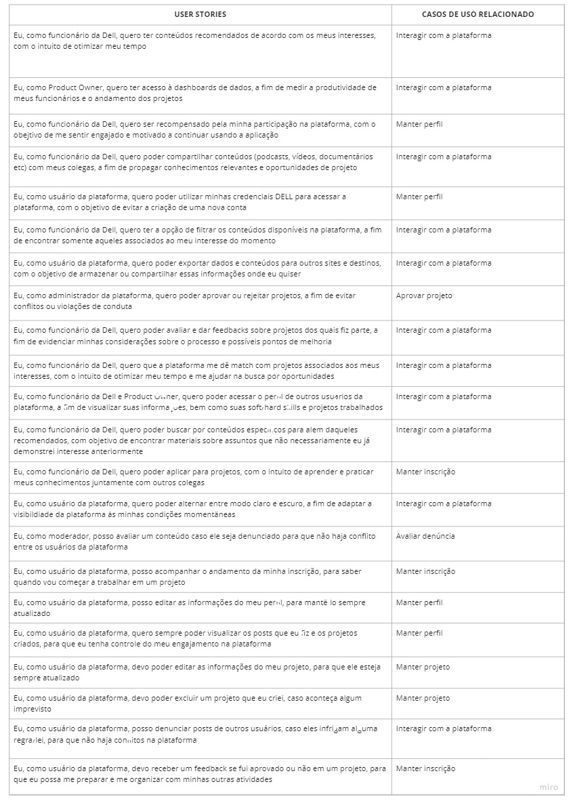

 Fonte: Elaborado pelo próprio autor (2023). 

 

## Matriz de rastreabilidade
Sabendo que o conceito de Matriz de rastreabilidade de requisitos pode ser definido por uma ferramenta que explicita a relação direta dos requisitos entre si ou com os outros componentes do projeto (ARTIA, 2020), e ainda auxilia para identificar alterações no projeto e o que elas afetam, viu-se a necessidade de criação de uma para a corrente solução, conforme taabela 2.
 

 Tabela 2 - Matriz de rastreabilidade.  

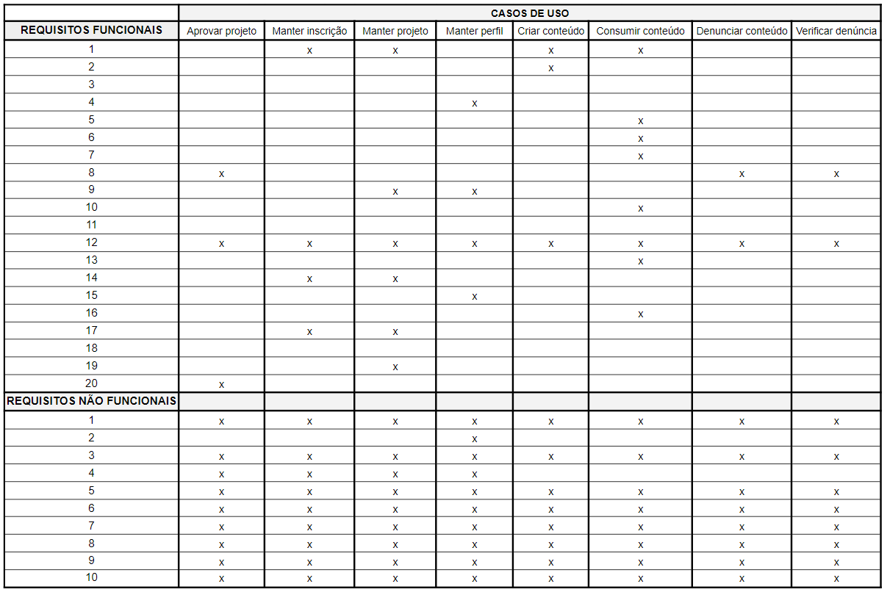

 Fonte: Elaborado pelo próprio autor (2023). 

# Arquitetura do Sistema
	
A arquitetura de um sistema de software é a estrutura fundamental que define como o sistema é organizado e como seus componentes interagem entre si para atender aos requisitos de software. Ela serve para garantir que o sistema seja escalável, flexível, fácil de manter e extensível ao longo do tempo, permitindo que os desenvolvedores construam um software de alta qualidade que atenda às necessidades dos usuários finais de maneira eficiente. Dessa forma, aqui se encontra a primeira versão da arquitetura do sistema:
	
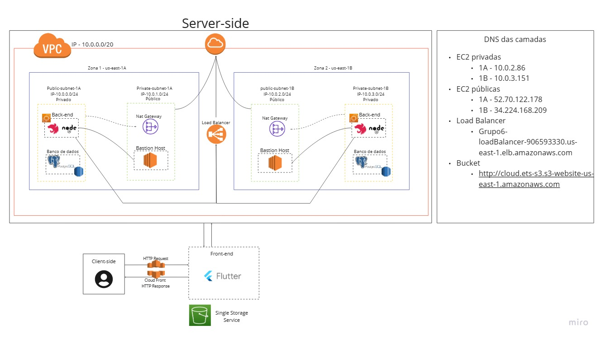

 Fonte: Elaborado pelo próprio autor (2023). 

## Diagrama de sequência do fluxo de dados

O diagrama de sequência de fluxo de dados é uma ferramenta de modelagem que descreve a interação entre diferentes componentes de um sistema, mostrando a sequência de eventos e as informações que fluem entre eles. Ele é utilizado para ilustrar o fluxo de dados em um sistema, permitindo que os desenvolvedores entendam como o sistema funciona e identifiquem oportunidades para melhorias e otimizações.
	
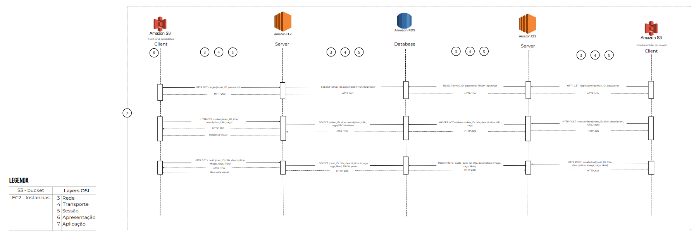

 Fonte: Elaborado pelo próprio autor (2023). 

# UX e UI Design

## Benchmarking e Revisão de Design System

O benchmarking é uma técnica de análise comparativa que permite identificar as melhores práticas em um determinado campo, em relação aos concorrentes ou empresas de referência. No caso de um Design System, o benchmarking pode ser útil para avaliar a eficácia e a qualidade do sistema, além de obter insights sobre como melhorá-lo. Dessa forma foi escolhido pela equipe os design systems da Apple e do Governo Brasileiro.

Ao fazer um benchmark utilizando 3 Design Systems, sendo um o principal e outros dois para comparação, foi possível perceber que a Dell é uma marca muito forte quando se fala em Design. Começando por um Design unificado, todas as 3 empresas, sendo elas a Dell, Apple e o Governo o possuem, já que utilizam o mesmo padrão em todos seus produtos e componentes. Pensando nisso, as três também possuem um Design universal, com ícones de significado convencional para a sociedade. Porém, apesar disso, os ícones da Dell tem um Design muito rústico, tradicional e quadrado, pouco utilizado hoje em dia e que costuma incomodar os olhos. Além disso, a tipografia da Dell também apresenta essas mesmas características, tanto que esse foi um dos pontos fracos encontrados na empresa. Em contrapartida, a Apple e o Governo do Brasil possuem uma iconografia e tipografia mais arredondados, o que costuma ser mais usado e agrada melhor os olhos. No geral, foi pedido que fosse utilizado o Design System da Dell, mas como foi observado, talvez mudar um pouco a iconografia e a tipografia seja mais agradável para a plataforma, porém isso é algo a se discutir com o cliente. Algo que foi decidido por manter completamente é a paleta de cores. A cor azul que a Dell usa é muito marcante e conhecida no mundo todo.

A tabela a seguir descreve a comparação entre os design systems escolhidos:
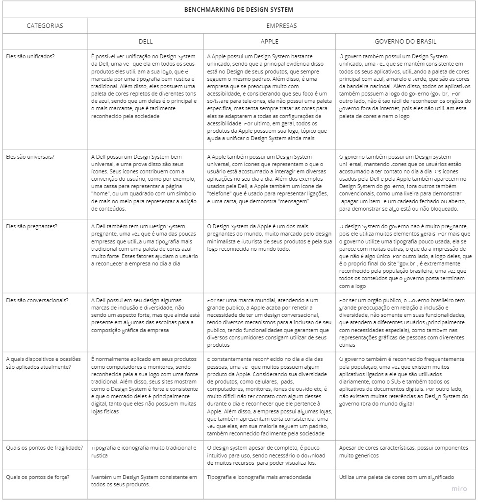

 Fonte: Elaborado pelo próprio autor (2023). 

## Wireframes

Telas de baixa fidelidade das áreas do usuário, conectados, demonstrando a diagramação e o fluxo de navegação.

Exemplos: tela da home, tela de login, etc. Em cada tela colocar: cabeçalho, rodapé, barra lateral, área de conteúdo.

Aqui você deve colocar o link para o wireframe ou colocar as imagens geradas na sequência correta do fluxo de navegação.

## Design de Interface - Guia de Estilos
Tratando-se de um documento que conttempa as diretrizes de design de uma empresa, garantindo a consistência da interface gráfica, esse apresenta definições de cores, tipografia, iconografia e grids. Dessa forma, seguindo o design system do parceiro, foi proposto o guia de estilos a seguir para a aplicação desenvolvida.

 Fonte: Elaborado pelo próprio autor (2023). 

# Projeto de Banco de Dados

Documento contendo diagrama de entidades e relacionamentos do banco de dados

## Modelo Conceitual

O modelo conceitual deve garantir uma conexão com a realidade. Os 4 tipos de conexões com a realidade são:
conceitos
atributos
identificações
associações
O Modelo Entidade-Relacionamento - MER
entidades e tipos de entidades
atributos e tipos de atributos
relacionamentos e tipos de relacionamentos

## Modelo Lógico 

O modelo lógico de banco de dados é uma representação abstrata e simplificada dos dados armazenados no sistema. É utilizado para entender como os dados são relacionados e para garantir a integridade e consistência dos dados armazenados. Incluir  uma descrição detalhada das tabelas, campos e relações presentes no modelo lógico de banco de dados. Também serão apresentadas as regras de negócio e as restrições aplicadas aos dados para garantir a integridade e a consistência dos dados armazenados.

# Testes de Software

## Teste Unitário

Link ou imagem da tabela com dados organizados dos testes realizados.

## Teste de Integração

Link ou imagem da tabela com dados organizados dos testes realizados.

## Teste de Regressão

Link ou imagem da tabela com dados organizados dos testes realizados.

## Teste de Usabilidade 

Link ou imagem da tabela com dados organizados dos testes realizados.

## Teste de Funcionalidade 

Link ou imagem da tabela com dados organizados dos testes realizados.

## Teste de API 

Link ou imagem da tabela com dados organizados dos testes realizados.

# Documentação da API

Apresentar a documentação no formato Swagger ou aplicação equivalente com todas as requisições dos endpoints desenvolvidos e funcionando.

# Manual do Usuário

Fornecer instruções detalhadas sobre como usar o software corretamente. É uma ferramenta valiosa para ajudar os usuários a compreender as funções do software, instalar o software, configurar as preferências do usuário, entre outras tarefas. O manual do usuário geralmente inclui screenshots, animações e outros recursos visuais para tornar a experiência do usuário mais clara e intuitiva. Além disso, ele também pode incluir informações sobre solução de problemas, dicas e truques, bem como informações de contato para suporte técnico. É importante que a seção de manual do usuário seja atualizada frequentemente para garantir que os usuários tenham acesso à informação mais recente e precisa sobre o software.

# Referências

Toda referência citada no texto deverá constar nessa seção, utilizando o padrão de normalização da ABNT - ABNT NBR 10520). As citações devem ser confiáveis e relevantes para o trabalho. São imprescindíveis as citações dos sites de download das ferramentas utilizadas, bem como a citação de algum objeto, música, textura ou outros que não tenham sido produzidos pelo grupo, mas utilizados (mesmo no caso de licenças gratuitas, royalty free ou similares).
Sugerimos o uso do sistema autor-data para citações.

https://artia.com/blog/matriz-de-rastreabilidade/ 01/05/2023

# Apêndice 

Os apêndices representam informações adicionais que não caberiam no documento exposto acima, mas que são importantes por alguma razão específica do projeto. 
