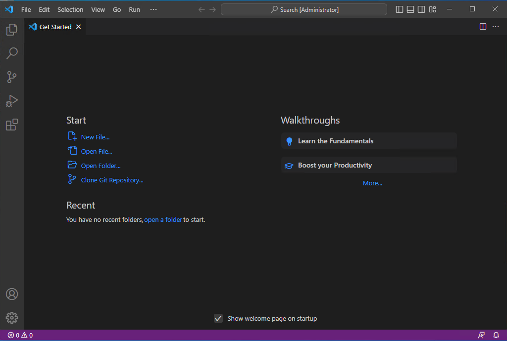
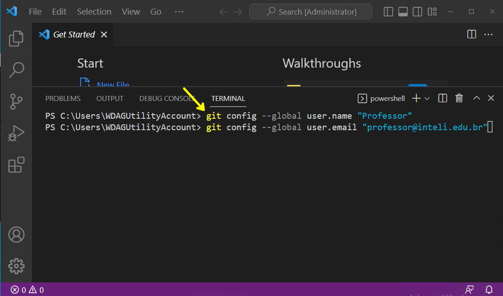
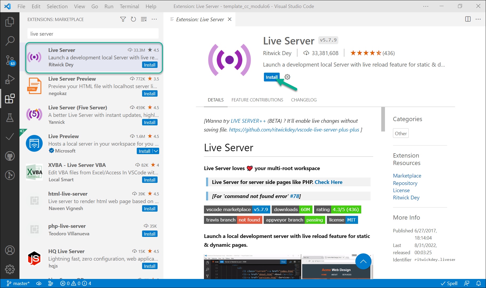

# Preparação do ambiente de trabalho no seu computador

Como no Inteli o Windows é o sistema operacional mais comumente utilizado, as instruções deste documente são específicas para computadores com este sistema. A instalação destas ferramentas em computadores com Linux ou MacOS é possível, mas provavelmente será necessário buscar procedimentos específicos para estes sistemas operacionais.

## Instalação do Git

Caso ainda não tenha o Git instalado no seu computador, faça o [download](https://git-scm.com/downloads) e execute a instalação. O Windows 11 já tem vindo com o Git instalado e, além da interface em linha de comandos, com o Git GUI que facilita o acesso através de uma interface gráfica.

Para verificar se o git está instalado, vá até a linha de comando e tente executar o comando:
git --version

Se a execução falhar, a instalação será necessária.

## Instalação do Visual Studio Code

O desenvolvimento do projeto pode utilizar vantajosamente o Visual Studio Code devido à sua facilidade de integração com o Git e o grande número de extensões disponíveis para ele (em particular, as extensões relacionadas ao formato Markdown).

Procedimento:

1. Acesse https://code.visualstudio.com/
2. Baixe o instalador indicado.
3. Faça a instalação do programa.
4. Execute o Visual studio Code: 
   

## Configuração do Git

1. Se esta é a primeira vez que você utiliza o Git no seu computador, execute o procedimento a seguir para configurar o usuário e o email (substitua os dados do exemplo (John Doe e johndoe@example.com) pelos seus - estes dados serão usados para o registro das contribuições de cada membro do time para o repositório do grupo):

git config --global user.name "John Doe"

git config --global user.email johndoe@example.com
2. Escolha cuidadosamente um local em seu computador onde ficarão todos os arquivo produzidos durante este módulo (programas-fonte, documentos, figuras, páginas em html, ou seja, todos os arquivos). Execute os comandos a seguir para criar o repositório local no diretório (pasta) escolhido e sincronizar com o repositório do grupo já criado no GitHub (substitua o # do exemplo pelo número do seu grupo:

git init

git clone origin https://github.com/2023M6T3-Inteli/Grupo-#.git
3. Você pode encontrar um curso sobre Git e Github no [W3Schools](https://www.w3schools.com/git/) e descrições detalhadas sobre o Git e seus comandos em [Pro Git](https://git-scm.com/book/en/v2).

## Configuração do Visual Studio Code com o Git:

1. No Visual Studio Code, abra um terminal: 
2. Execute os comandos para configurar o seu nome e o seu email: 

## Instalação da extensão *Live Server*

Acesse a área das extensões e instale o *Live Server*.

## Instalação da extensão *GitHub Pull Requests and Issues*

1. Execute o Visual Studio Code.
2. Acesse a área das extensões e instale a extensão *GitHub Pull Requests and Issues*.

## Instalação das extensões do Visual Studio Code para a elaboração da documentação

A documentação do projeto utiliza o formato Markdown. Para tornar mais conveniente a edição de arquivos neste formato, vamos instalar no Visual Studio Code algumas extensões específicas para Markdown.

Procedimento:

1. Execute o Visual Studio Code.
2. Acesse a área das extensões e instale o *Markdown All in One*: 

## Próximos passos

Após a instalação de todos os itens deste documento, vá para a página com os [procedimentos de validação do ambiente](./validacao_aluno.md).
